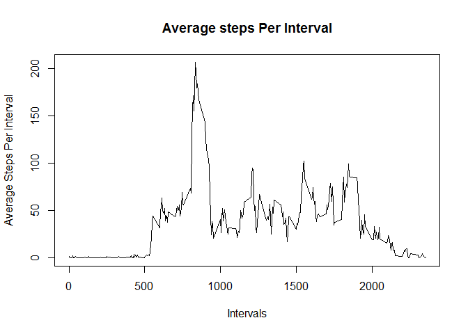
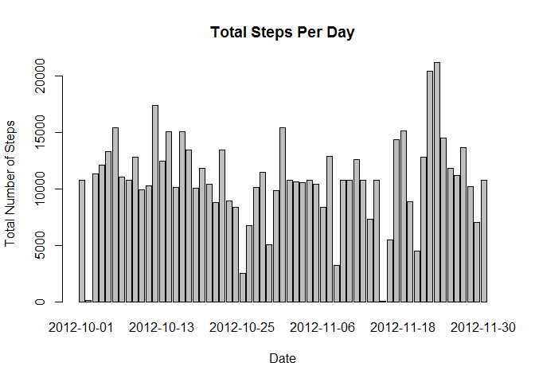
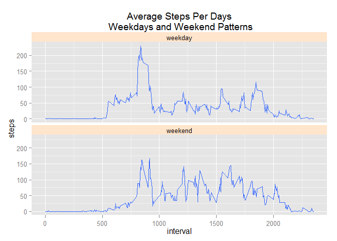

# Reproducible Research: Peer Assessment 1
X Zhu  
Saturday, September 13, 2014  

knitr::opts_chunk$set(echo=TRUE)  
setwd("C:\\Users\\xiaoqun\\DataScienceSpecialization\\ReproducibleResearch\\RepData_PeerAssessment1")

##Loading and preprocessing the data
1. Load data

```r
unzip("activity.zip")
activity<-read.csv("activity.csv", stringsAsFactors = FALSE)
str(activity)
```

```
## 'data.frame':	17568 obs. of  3 variables:
##  $ steps   : int  NA NA NA NA NA NA NA NA NA NA ...
##  $ date    : chr  "2012-10-01" "2012-10-01" "2012-10-01" "2012-10-01" ...
##  $ interval: int  0 5 10 15 20 25 30 35 40 45 ...
```
2. Change the data type of date from a string variable now, to a date type.

```r
activity$date<-as.Date(activity$date, format = '%Y-%m-%d')
head(activity)
```

```
##   steps       date interval
## 1    NA 2012-10-01        0
## 2    NA 2012-10-01        5
## 3    NA 2012-10-01       10
## 4    NA 2012-10-01       15
## 5    NA 2012-10-01       20
## 6    NA 2012-10-01       25
```

##What is mean total number of steps taken per day?
1. Make a histogram of the total number of steps taken each day

Aggrigating by date

```r
TotalDailySteps <- aggregate(steps~date, activity,sum, na.rm=TRUE)
histogram<-barplot(TotalDailySteps$steps, names.arg =TotalDailySteps$date, 
                   xlab = "Date", ylab="Total Daily Steps", 
                   main="Number of Steps Per Day")
```

 

2. Calculate and report the mean and median total number of steps taken per day

```r
mean(TotalDailySteps$steps,na.rm=TRUE)
```

```
## [1] 10766
```

```r
median(TotalDailySteps$steps,na.rm=TRUE)
```

```
## [1] 10765
```

##What is the average daily activity pattern?
1. Make a time series plot (i.e. type = "l") of the 5-minute interval (x-axis) and the average number of steps taken, averaged across all days (y-axis)

```r
AverageInterval <- aggregate(steps ~ interval, activity, mean)
plot(AverageInterval, type = "l", xlab="Intervals", ylab="Average Steps Per Interval", 
     main="Average steps Per Interval")
```

 

2. Which 5-minute interval, on average across all the days in the dataset, contains the maximum number of steps?

```r
AverageInterval$interval[which.max(AverageInterval$steps)]
```

```
## [1] 835
```

##Imputing missing values
1. Calculate and report the total number of missing values in the dataset (i.e. the total number of rows with NAs)

```r
sum(!complete.cases(activity))
```

```
## [1] 2304
```

2. Devise a strategy for filling in all of the missing values in the dataset. The strategy does not need to be sophisticated. For example, you could use the mean/median for that day, or the mean for that 5-minute interval, etc.  
I use mean to fill the missing value here.

3. Create a new dataset that is equal to the original dataset but with the missing data filled in.

```r
activity <- merge(activity,AverageInterval, by = "interval", suffixes = c("", ".y"))
nas <- is.na(activity$steps)
activity$steps[nas] <- activity$steps.y[nas]
activity <- activity[, c(1:3)]
```

4. Make a histogram of the total number of steps taken each day.

```r
TotalStepsPerDay <- aggregate(steps ~ date,activity,sum)
barplot(TotalStepsPerDay$steps, names.arg = TotalStepsPerDay$date, 
        xlab = "Date", ylab = "Total Number of Steps",main="Total Steps Per Day")
```

 

Calculate and report the mean and median total number of steps taken per day. Do these values differ from the estimates from the first part of the assignment? What is the impact of imputing missing data on the estimates of the total daily number of steps?

Mean and Median

```r
mean(TotalStepsPerDay$steps)
```

```
## [1] 10766
```

```r
median(TotalStepsPerDay$steps)
```

```
## [1] 10766
```


##Are there differences in activity patterns between weekdays and weekends?

1.Create a new factor variable in the dataset with two levels – “weekday” and “weekend” indicating whether a given date is a weekday or weekend day.

```r
activity$dayType <- ifelse(weekdays(activity$date) %in%  c("Saturday", "Sunday"),'weekend','weekday')
head(activity)
```

```
##   interval steps       date dayType
## 1        0 1.717 2012-10-01 weekday
## 2        0 0.000 2012-11-23 weekday
## 3        0 0.000 2012-10-28 weekend
## 4        0 0.000 2012-11-06 weekday
## 5        0 0.000 2012-11-24 weekend
## 6        0 0.000 2012-11-15 weekday
```

```r
table(activity$dayType)
```

```
## 
## weekday weekend 
##   12960    4608
```

2.Make a panel plot containing a time series plot (i.e. type = "l") of the 5-minute interval (x-axis) and the average number of steps taken, averaged across all weekday days or weekend days (y-axis). 

```r
library(ggplot2)
qplot(x=interval, y=steps,data=subset(activity, complete.cases(activity)),
      geom='smooth', stat='summary', fun.y=mean) + facet_grid(dayType~.) + 
      facet_wrap(~dayType,nrow=2) + theme(strip.background = element_rect(fill="#ffe5cc")) + 
      labs(title=' Average Steps Per Days \n Weekdays and Weekend Patterns')
```

 
